# 📊 OneCampus Complete System Overview - Single PPT Slide

## 🎯 Comprehensive System Architecture (Perfect for One PowerPoint Slide)

```mermaid
graph TB
    subgraph "👥 USER ROLES"
        Admin["🔧 ADMIN<br/>System Control<br/>Analytics & Reports"]
        Staff["👨‍💼 STAFF<br/>Academic Ops<br/>Student & Fee Mgmt"]
        Warden["🏠 WARDEN<br/>Hostel Mgmt<br/>Room Allocation"]
        Student["🎓 STUDENT<br/>Personal Portal<br/>Fees & Exams"]
    end

    subgraph "🔐 SECURITY & AUTH"
        Auth["🔑 JWT Authentication<br/>Role-Based Access Control<br/>Multi-layer Security"]
    end

    subgraph "💻 MODERN FRONTEND"
        Frontend["⚡ React 19 + Next.js 15<br/>TypeScript + Tailwind CSS<br/>📱 PWA + Mobile Responsive"]
    end

    subgraph "🚀 BACKEND API"
        Backend["💚 Node.js + Express.js<br/>RESTful APIs<br/>Real-time Processing"]
    end

    subgraph "📊 CORE MODULES"
        StudentMgmt["👨‍🎓 STUDENT MANAGEMENT<br/>• Admissions & Profiles<br/>• Academic Records<br/>• Document Storage"]

        FeeMgmt["💰 FEE MANAGEMENT<br/>• Payment Processing<br/>• Digital Receipts<br/>• Financial Analytics"]

        HostelMgmt["🏠 HOSTEL MANAGEMENT<br/>• Room Allocation<br/>• Occupancy Tracking<br/>• Maintenance Requests"]

        ExamMgmt["📝 EXAM MANAGEMENT<br/>• Scheduling & Registration<br/>• Admit Cards<br/>• Result Publication"]
    end

    subgraph "☁️ CLOUD INFRASTRUCTURE"
        Database["🔥 Firebase Firestore<br/>Real-time NoSQL Database<br/>📁 Cloud Storage"]

        Performance["⚡ PERFORMANCE<br/>• Auto-scaling<br/>• CDN Delivery<br/>• 99.9% Uptime"]
    end

    subgraph "📈 ANALYTICS & INSIGHTS"
        Analytics["📊 REAL-TIME ANALYTICS<br/>• Enrollment Trends<br/>• Revenue Tracking<br/>• Occupancy Reports<br/>• Performance KPIs"]
    end

    Admin --> Auth
    Staff --> Auth
    Warden --> Auth
    Student --> Auth

    Auth --> Frontend
    Frontend --> Backend
    Backend --> StudentMgmt
    Backend --> FeeMgmt
    Backend --> HostelMgmt
    Backend --> ExamMgmt

    StudentMgmt --> Database
    FeeMgmt --> Database
    HostelMgmt --> Database
    ExamMgmt --> Database

    Database --> Performance
    Database --> Analytics

    StudentMgmt -.-> Analytics
    FeeMgmt -.-> Analytics
    HostelMgmt -.-> Analytics
    ExamMgmt -.-> Analytics

    %% Enhanced styling for better visibility
    style Admin fill:#1e88e5,stroke:#0d47a1,stroke-width:3px,color:#ffffff
    style Staff fill:#43a047,stroke:#1b5e20,stroke-width:3px,color:#ffffff
    style Warden fill:#fb8c00,stroke:#e65100,stroke-width:3px,color:#ffffff
    style Student fill:#8e24aa,stroke:#4a148c,stroke-width:3px,color:#ffffff

    style Auth fill:#d32f2f,stroke:#b71c1c,stroke-width:3px,color:#ffffff
    style Frontend fill:#1976d2,stroke:#0d47a1,stroke-width:3px,color:#ffffff
    style Backend fill:#388e3c,stroke:#1b5e20,stroke-width:3px,color:#ffffff

    style StudentMgmt fill:#e3f2fd,stroke:#1976d2,stroke-width:3px,color:#01579b
    style FeeMgmt fill:#e8f5e9,stroke:#43a047,stroke-width:3px,color:#1b5e20
    style HostelMgmt fill:#fff3e0,stroke:#fb8c00,stroke-width:3px,color:#e65100
    style ExamMgmt fill:#f3e5f5,stroke:#8e24aa,stroke-width:3px,color:#4a148c

    style Database fill:#fff8e1,stroke:#f57f17,stroke-width:3px,color:#f57f17
    style Performance fill:#e0f2f1,stroke:#00897b,stroke-width:3px,color:#004d40
    style Analytics fill:#fce4ec,stroke:#c2185b,stroke-width:3px,color:#880e4f
```



## 📋 PPT Implementation Guide

### **How to Use This Diagram in PowerPoint:**

#### **Option 1: Auto-Generate from Mermaid (Recommended)**
1. **Copy the Mermaid code above**
2. **Go to [mermaid.live](https://mermaid.live)**
3. **Paste the code** and preview the diagram
4. **Export as PNG/SVG** (high resolution recommended)
5. **Insert into PowerPoint** and resize to fit slide

#### **Option 2: Manual Recreation in PowerPoint**
1. **Use PowerPoint SmartArt** → "Hierarchy" or "Process"
2. **Create text boxes** for each component
3. **Apply the color scheme** provided below
4. **Add arrows** to show relationships
5. **Insert icons/emojis** for visual appeal

#### **Option 3: Online Mermaid Tools**
- **GitHub/GitLab**: Paste code directly in markdown files
- **Notion**: Use `/mermaid` block
- **Draw.io**: Import mermaid code
- **Confluence**: Mermaid macro available

---

## 🎨 Design Specifications for PPT

### **Slide Layout Recommendations:**
- **Slide Title**: "OneCampus System Architecture Overview"
- **Slide Size**: 16:9 widescreen format
- **Diagram Position**: Center of slide with 10% margins
- **Background**: White or very light gray (#f8f9fa)

### **Color Palette (Material Design)**
```
🔵 User Roles:
- Admin: #1e88e5 (Blue 600)
- Staff: #43a047 (Green 600)
- Warden: #fb8c00 (Orange 600)
- Student: #8e24aa (Purple 600)

🔴 Security: #d32f2f (Red 700)
🔵 Frontend: #1976d2 (Blue 700)
🟢 Backend: #388e3c (Green 700)

💙 Light Backgrounds:
- Student Mgmt: #e3f2fd (Blue 50)
- Fee Mgmt: #e8f5e8 (Green 50)
- Hostel Mgmt: #fff3e0 (Orange 50)
- Exam Mgmt: #f3e5f5 (Purple 50)
- Database: #fff8e1 (Yellow 50)
- Performance: #e0f2f1 (Teal 50)
- Analytics: #fce4ec (Pink 50)
```

### **Typography for Manual Creation:**
- **Main Headers**: Arial Bold, 14pt
- **Sub-headers**: Arial Bold, 12pt
- **Body Text**: Arial Regular, 10pt
- **Icons**: Use system emojis or font icons

### **Diagram Dimensions:**
- **Total Width**: 1200px (fits 16:9 slide)
- **Total Height**: 800px (optimal for readability)
- **Node Width**: 180-220px
- **Node Height**: 80-100px
- **Line Thickness**: 2-3px

---

## 🎯 Presentation Talking Points

### **Opening Statement:**
*"This single diagram shows the complete OneCampus architecture - from users to infrastructure. Let me walk you through how everything connects..."*

### **Section-by-Section Explanation:**

#### **👥 User Roles (Top Section):**
*"Four distinct user types, each with tailored access and features. Notice how each role has specific responsibilities and interfaces."*

#### **🔐 Security Layer:**
*"Security isn't an afterthought - it's the foundation. JWT authentication with role-based access control protects every interaction."*

#### **💻 Frontend Technology:**
*"Modern web technologies ensure fast, responsive, mobile-friendly experiences. This isn't your typical educational software."*

#### **📊 Core Modules (Center):**
*"Four integrated modules handle every aspect of college management. Notice the bullet points showing key features of each."*

#### **☁️ Infrastructure (Bottom):**
*"Cloud-native architecture with Firebase provides real-time data and automatic scaling. Performance is built-in, not bolted-on."*

### **Key Takeaways to Emphasize:**
1. **Comprehensive Solution** - Everything in one platform
2. **Modern Technology** - Built with latest tools and frameworks
3. **Real-time Capabilities** - Instant updates across all modules
4. **Scalable Architecture** - Grows with your institution
5. **Security First** - Multiple layers of protection

---

## 📊 Alternative Presentation Formats

### **For Executive Presentations:**
- Focus on business value and ROI
- Emphasize "Real-time Analytics" and "Performance" sections
- Highlight cost savings and efficiency improvements

### **For Technical Audiences:**
- Deep-dive into technology stack details
- Discuss scalability and security architecture
- Show API capabilities and integration options

### **For End-User Demos:**
- Start with user roles and their specific benefits
- Show how modules connect to daily workflows
- Emphasize ease of use and mobile accessibility

---

## 🚀 Quick Setup Instructions

### **For Immediate Use:**
1. **Copy the mermaid code** (lines 5-93)
2. **Visit [mermaid.live](https://mermaid.live)**
3. **Paste and export** as PNG (1200x800px recommended)
4. **Insert into PowerPoint** slide
5. **Add slide title**: "OneCampus System Architecture"

### **Customization Options:**
- **Change colors** by modifying the `style` lines (72-88)
- **Adjust text** by editing node descriptions
- **Resize elements** by changing subgraph organization
- **Add company branding** in PowerPoint after import

This single, comprehensive diagram effectively communicates the entire OneCampus system architecture in one visually appealing, presentation-ready format! 🎯