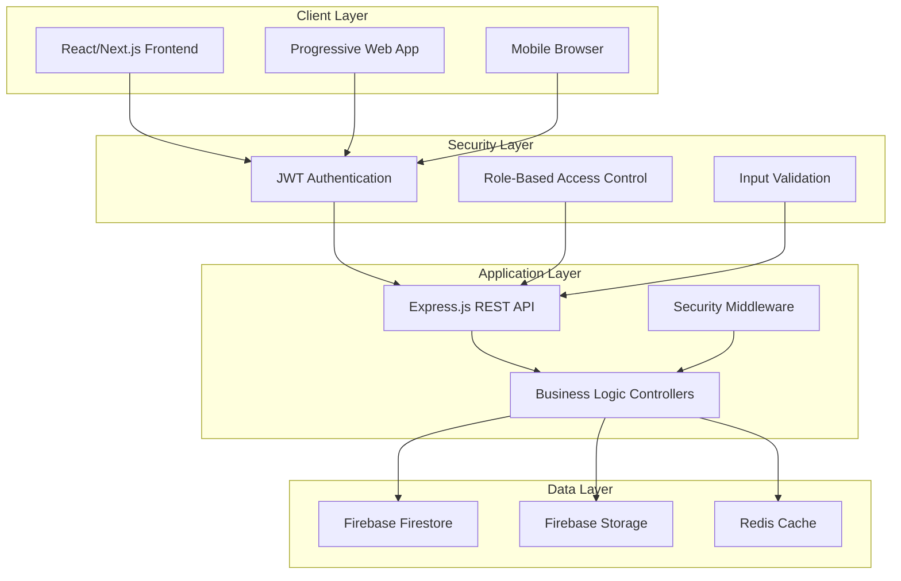
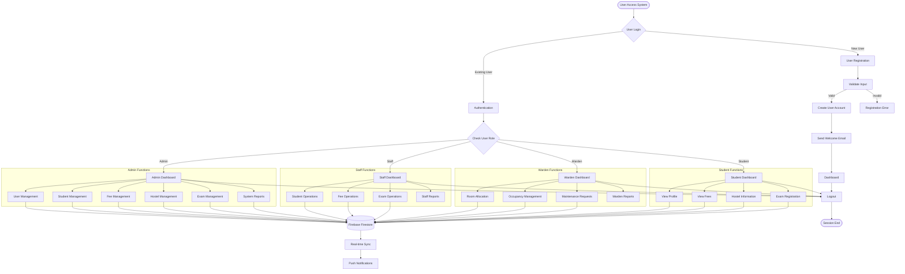
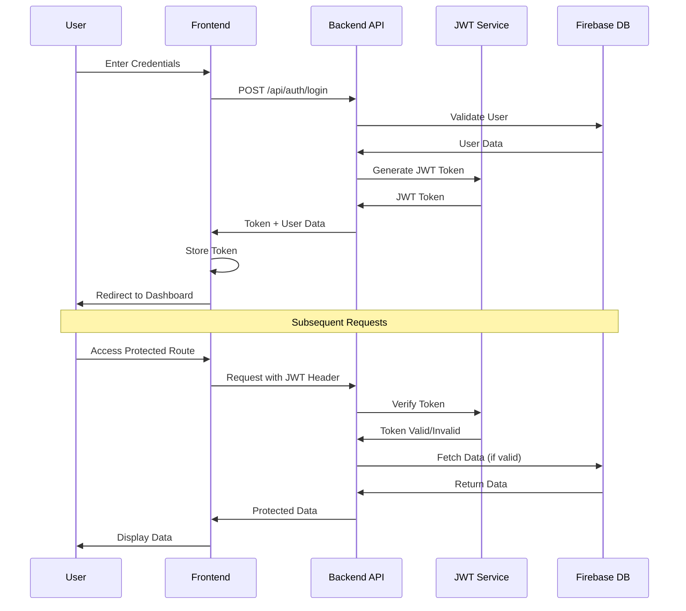
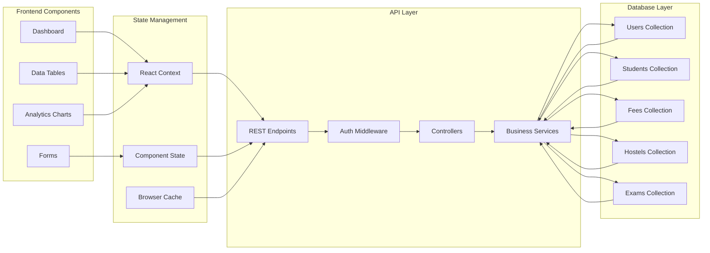
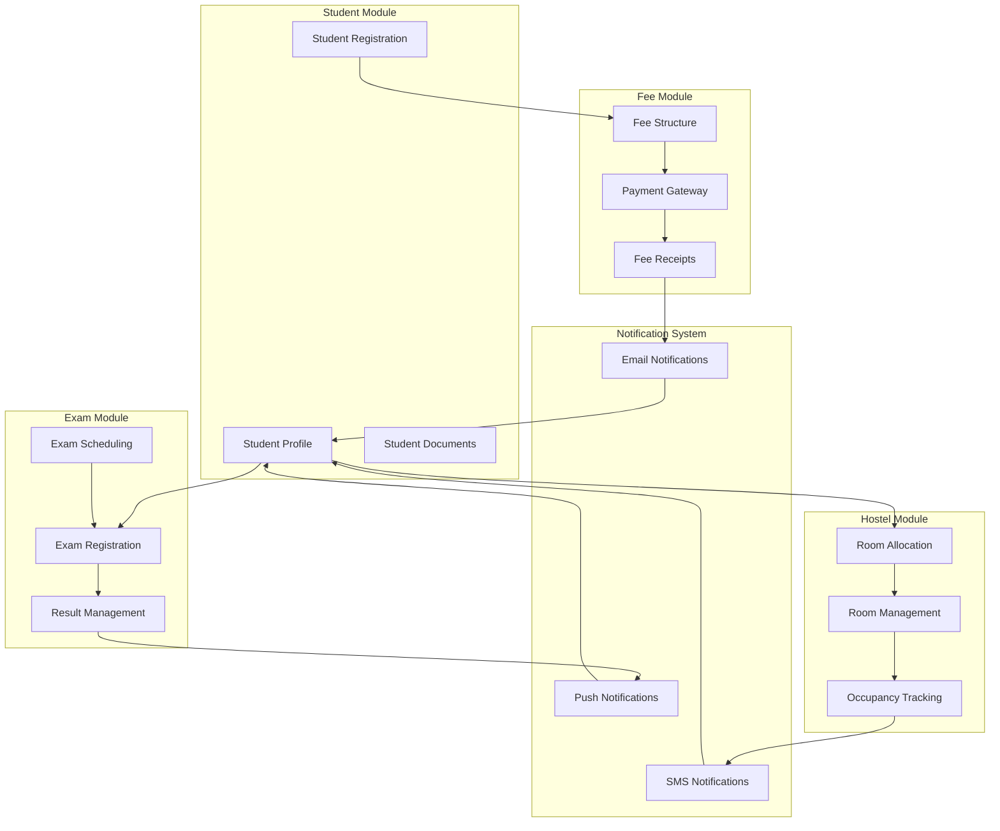
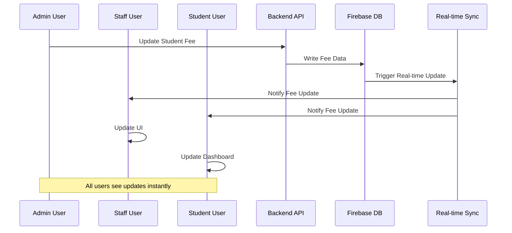
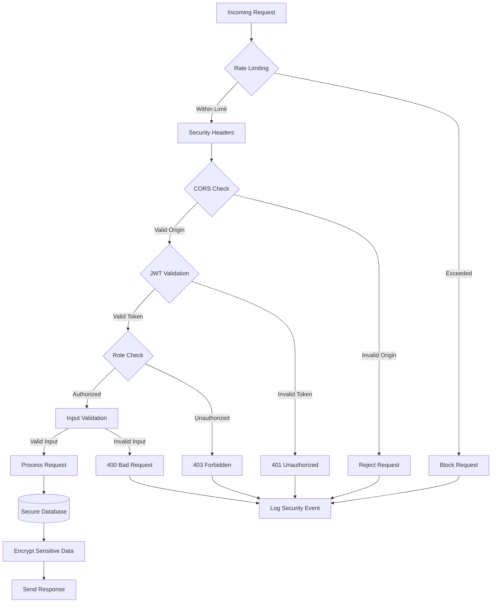
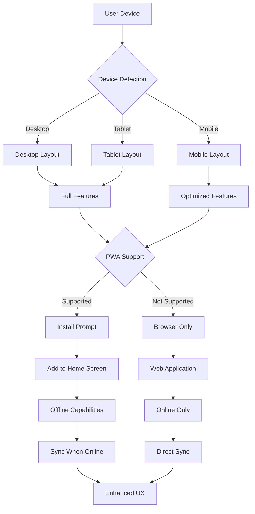
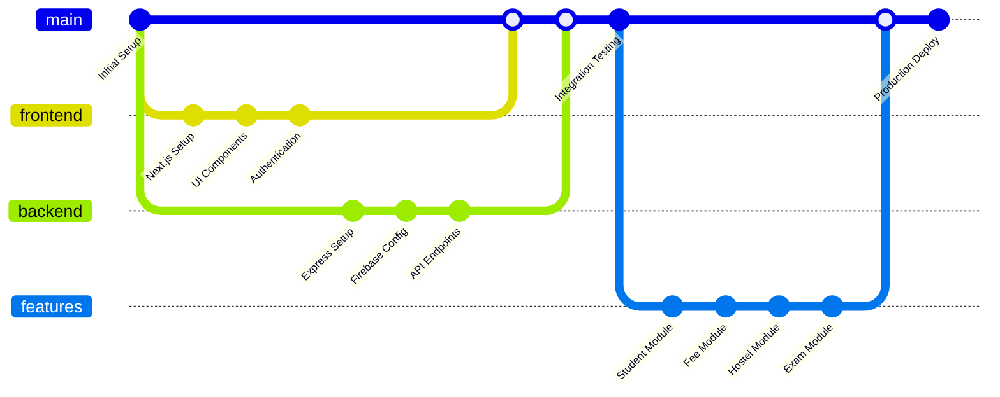
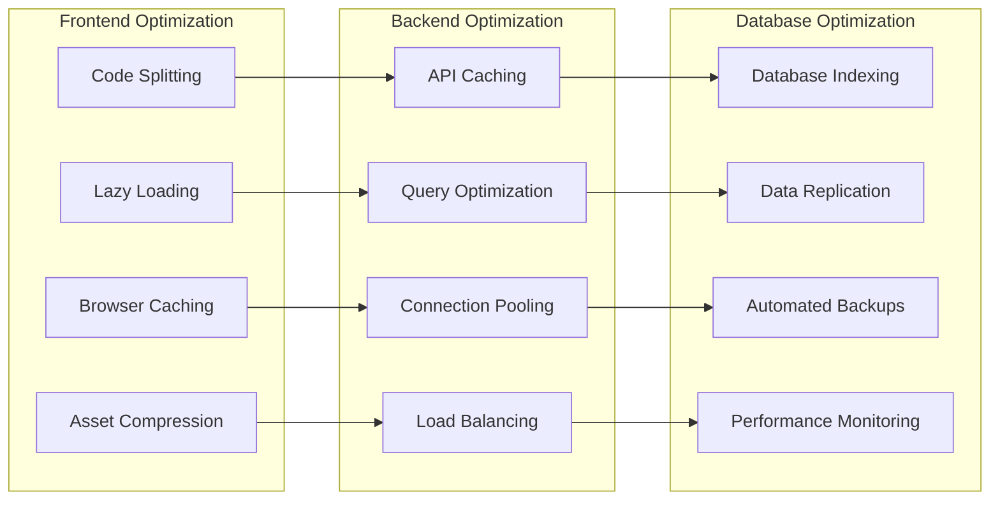

# 🎯 OneCampus College ERP System - System Architecture & Flowchart

## 🌐 System Architecture Overview

## 🏗️ Detailed System Flow

## 🔐 Authentication & Authorization Flow

## 📊 Data Flow Architecture

## 🏢 Module Interaction Flow

## 🔄 Real-time Data Synchronization

## 🛡️ Security Flow

## 📱 Mobile & Responsive Flow

## 🔧 Development Workflow

## 📈 Performance Optimization Flow

